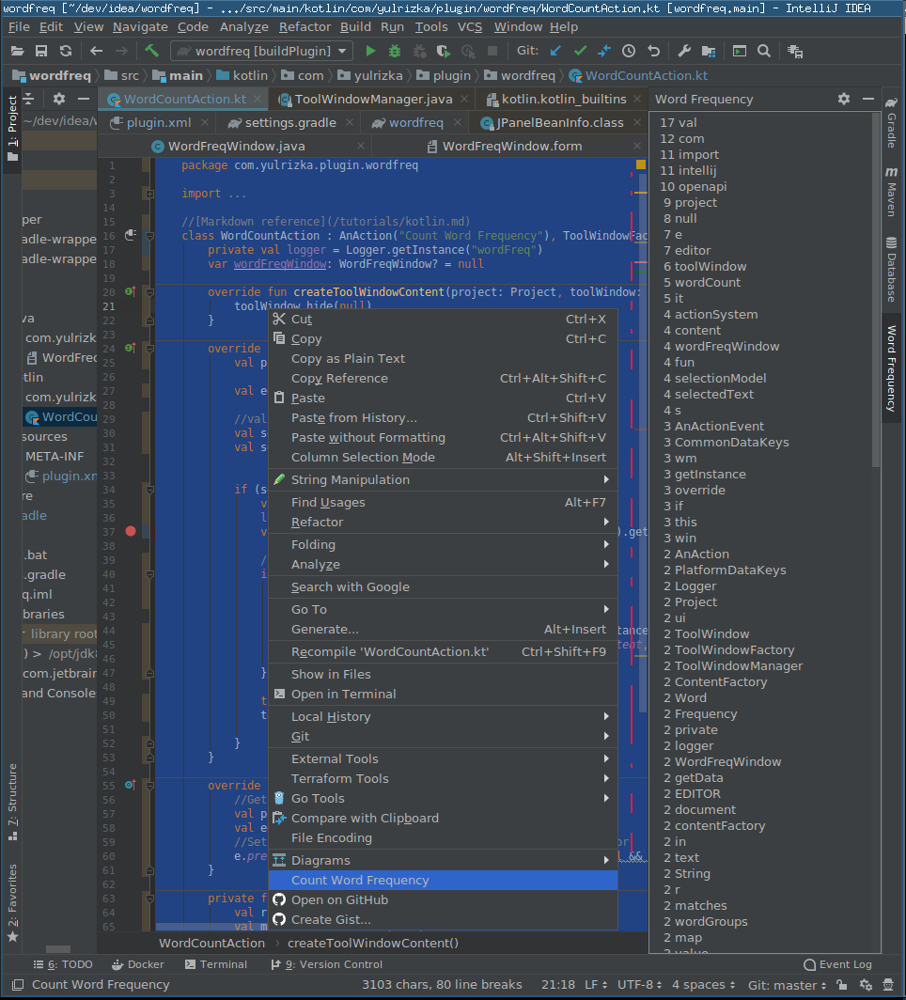

# Word Frequency intelliJ Plugin

This plugins provides action to count each word frequency from selected text.
It is useful when exploring code to quickly see important words.

This plugins gives you 3 metrics:

* **count**: the frequency of a term
* **span**: number of line between the first and last encounter of the term
* **proportion**: percentage line of the span comparing to the whole selected text

